# End-to-End Machine Learning Project Workflow
## Complete Cheat Sheet

> **Chapter 2**: A comprehensive visual guide to the 8-step machine learning workflow for building production-ready ML systems.

---

## 📋 Table of Contents

1. [Workflow Overview](#workflow-overview)
2. [Step 1: Look at the Big Picture](#step-1-look-at-the-big-picture)
3. [Step 2: Get the Data](#step-2-get-the-data)
4. [Step 3: Explore and Visualize](#step-3-explore-and-visualize)
5. [Step 4: Prepare the Data](#step-4-prepare-the-data)
6. [Step 5: Select and Train Models](#step-5-select-and-train-models)
7. [Step 6: Fine-Tune Your Model](#step-6-fine-tune-your-model)
8. [Step 7: Present Your Solution](#step-7-present-your-solution)
9. [Step 8: Launch, Monitor, and Maintain](#step-8-launch-monitor-and-maintain)
10. [Key Takeaways](#key-takeaways)

---

## Workflow Overview

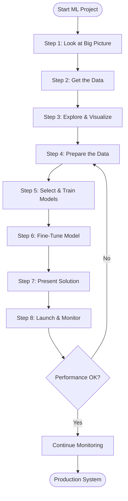

---

## Step 1: Look at the Big Picture

### 🎯 Objective
Define the business problem and frame it as a machine learning task.

### Main Components

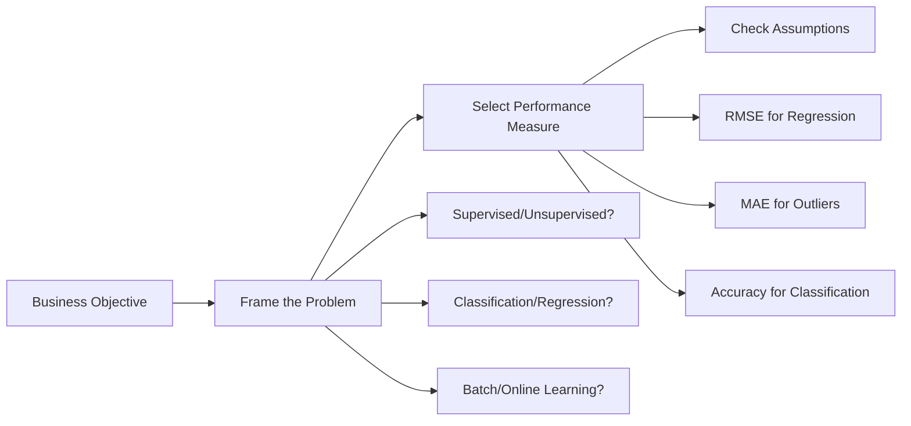

### Key Questions to Ask

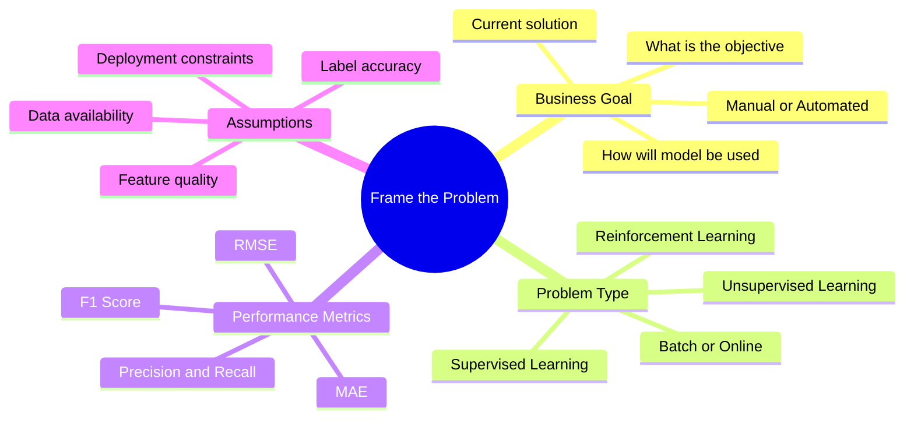

### Performance Measures

| **Metric** | **Use Case** | **Formula** | **Characteristics** |
|------------|--------------|-------------|---------------------|
| **RMSE** | Regression (standard) | √(Σ(ŷ - y)² / m) | Sensitive to outliers |
| **MAE** | Regression (with outliers) | Σ\|ŷ - y\| / m | Less sensitive to outliers |
| **Accuracy** | Classification | Correct / Total | Good for balanced datasets |
| **Precision** | Classification (minimize false positives) | TP / (TP + FP) | Focus on positive predictions |
| **Recall** | Classification (minimize false negatives) | TP / (TP + FN) | Focus on finding all positives |

---

## Step 2: Get the Data

### 🎯 Objective
Acquire, load, and create a reliable train/test split.

### Data Acquisition Flow

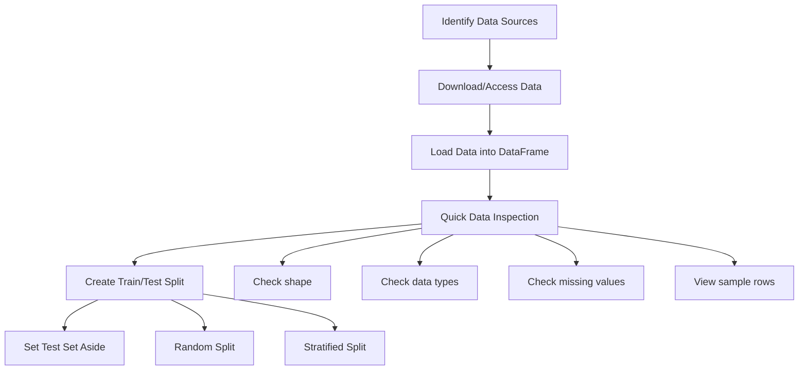

### Train/Test Split Strategies

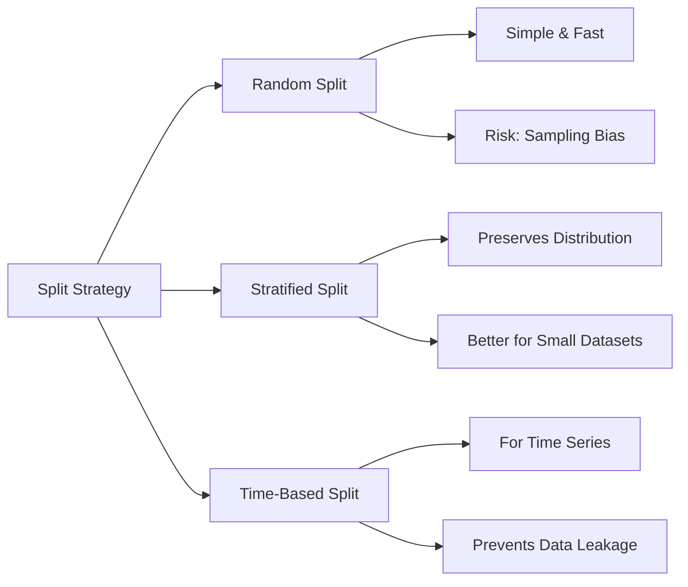

### Data Inspection Checklist

> [!IMPORTANT]
> **Critical Checks Before Proceeding**
> - ✅ Number of instances (rows)
> - ✅ Number of features (columns)
> - ✅ Data types of each feature
> - ✅ Missing values count
> - ✅ Categorical vs numerical features
> - ✅ Target variable distribution
> - ✅ Class balance (for classification)

---

## Step 3: Explore and Visualize

### 🎯 Objective
Gain insights through visualization and statistical analysis.

### Exploration Workflow

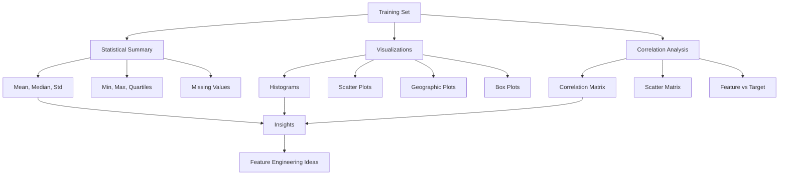

### Visualization Types

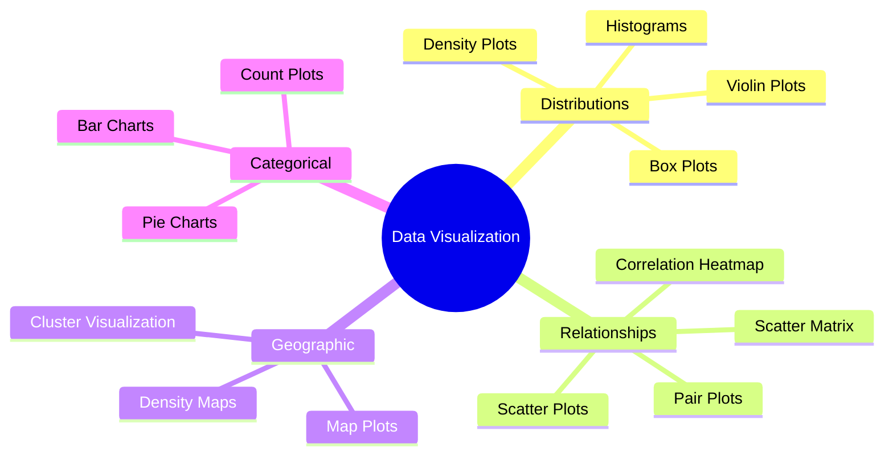

### Correlation Analysis

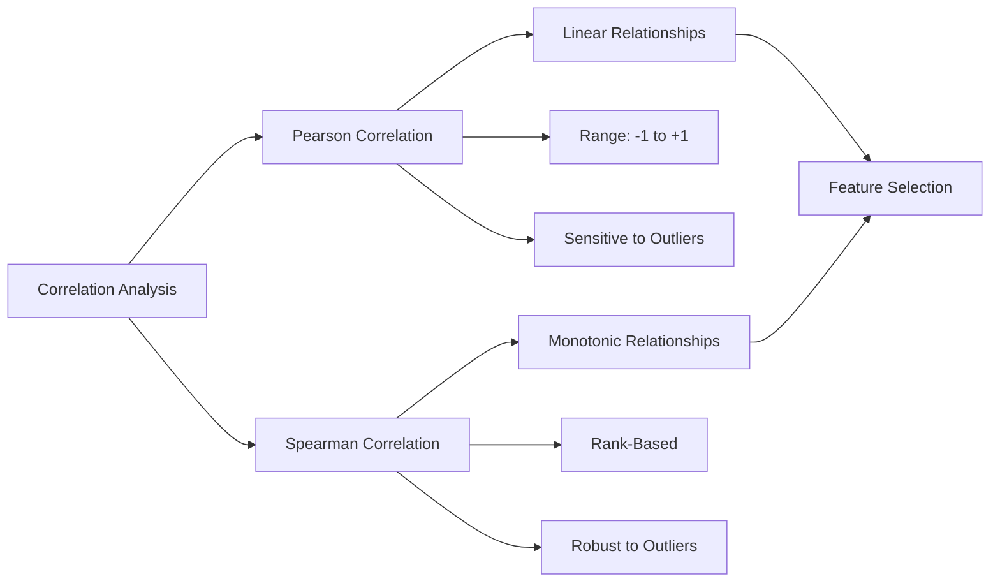

> [!TIP]
> **Key Insights to Look For**
> - Features with strong correlation to target
> - Skewed distributions (may need transformation)
> - Outliers and anomalies
> - Missing data patterns
> - Geographic or temporal patterns
> - Potential feature combinations

---

## Step 4: Prepare the Data

### 🎯 Objective
Transform raw data into a clean format suitable for ML algorithms.

### Data Preparation Pipeline

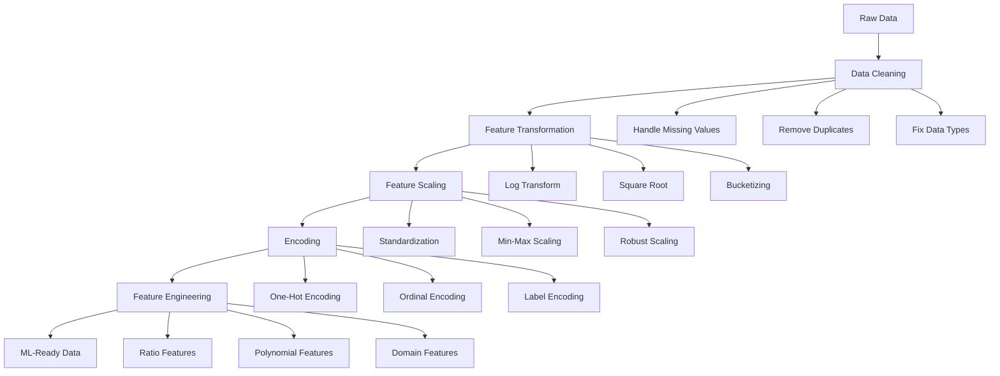

### Handling Missing Values

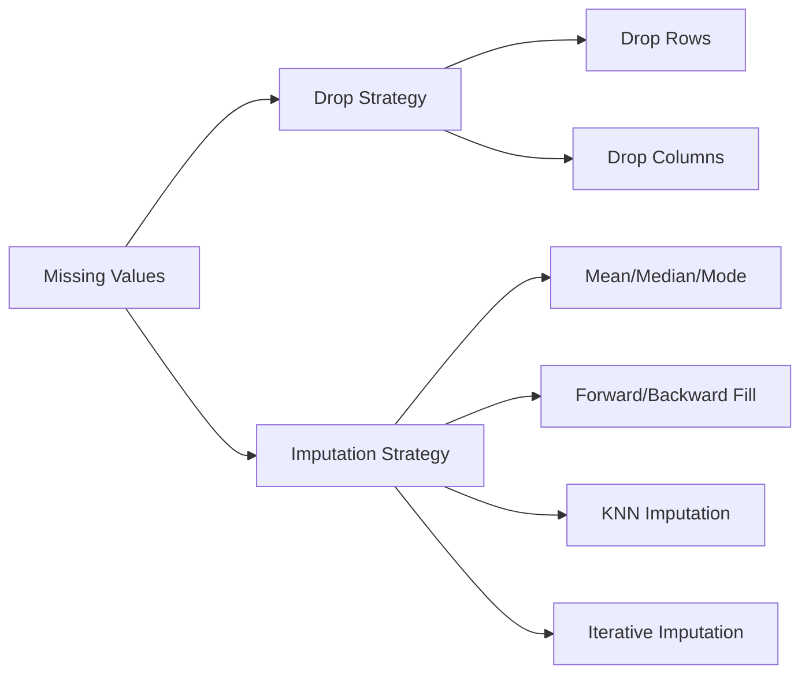

### Feature Scaling Methods

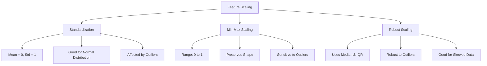

### Encoding Categorical Features

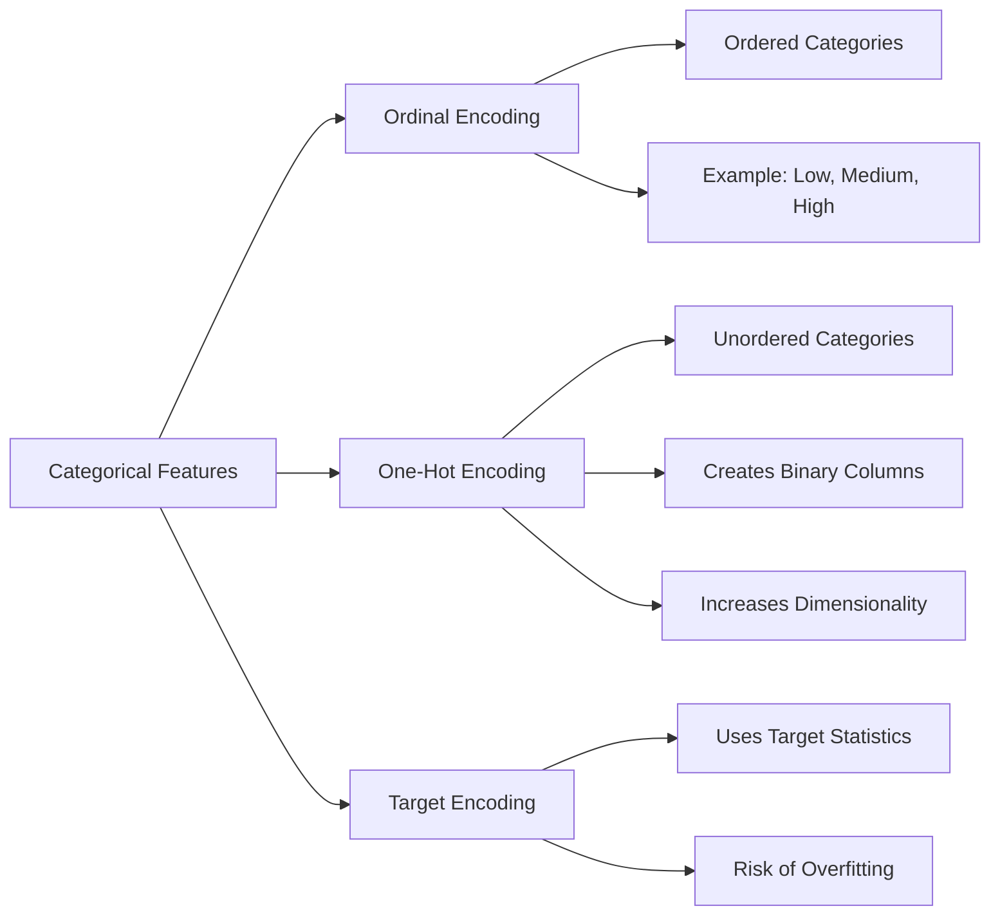

### Transformation Pipeline Architecture

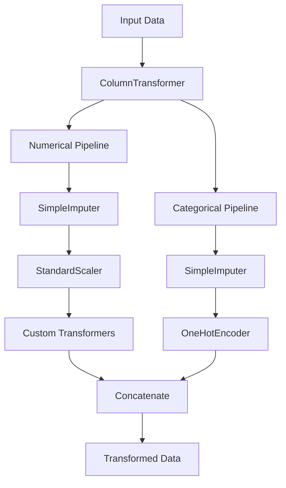

> [!WARNING]
> **Common Pitfalls to Avoid**
> - ❌ Fitting scalers on test data
> - ❌ Data leakage from train to test
> - ❌ Forgetting to handle new categories
> - ❌ Scaling before train/test split
> - ❌ Not saving transformation parameters

---

## Step 5: Select and Train Models

### 🎯 Objective
Train multiple models and evaluate their performance.

### Model Selection Process

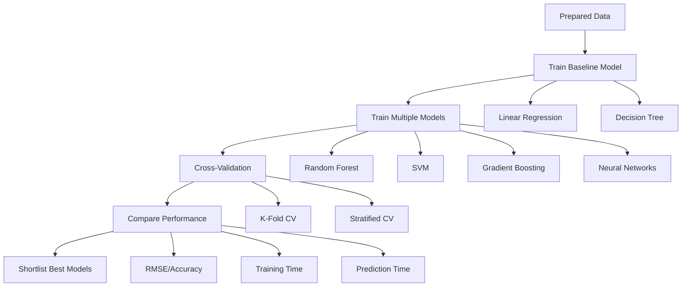

### Model Types by Problem

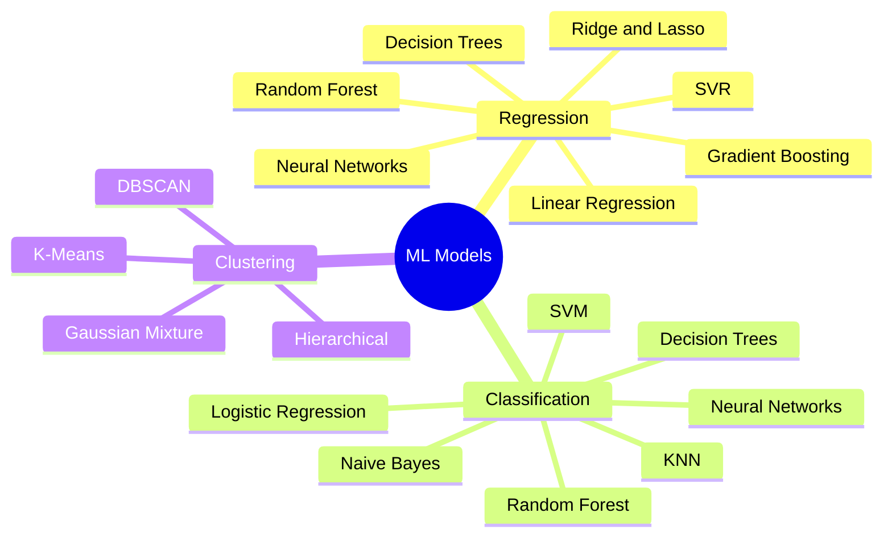

### Cross-Validation Strategy

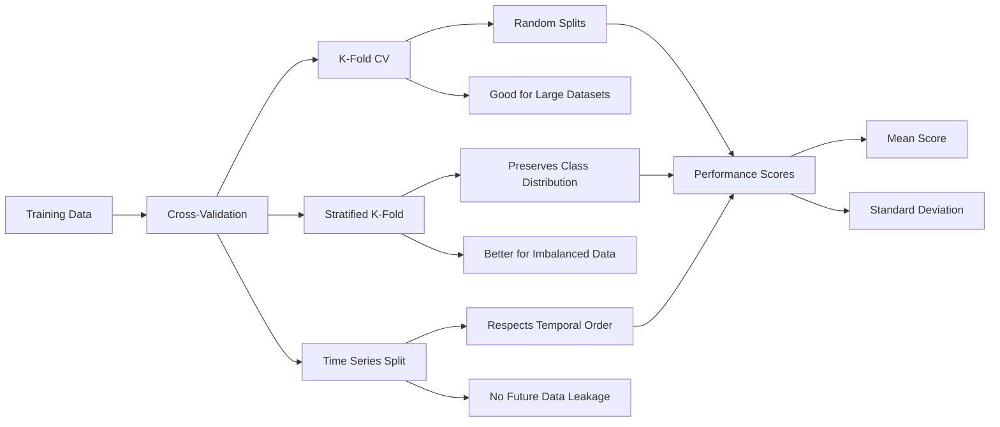

### Model Comparison Matrix

| **Model** | **Pros** | **Cons** | **Best For** |
|-----------|----------|----------|--------------|
| **Linear Regression** | Simple, Fast, Interpretable | Assumes linearity | Linear relationships |
| **Decision Tree** | Non-linear, Interpretable | Prone to overfitting | Complex patterns |
| **Random Forest** | Robust, Handles non-linearity | Slower, Less interpretable | General purpose |
| **Gradient Boosting** | High accuracy | Slow training, Hyperparameter sensitive | Competitions |
| **SVM** | Effective in high dimensions | Slow for large datasets | Small to medium data |
| **Neural Networks** | Extremely flexible | Needs lots of data, Hard to tune | Large datasets, complex patterns |

> [!NOTE]
> **Training Best Practices**
> - Start with simple models (baseline)
> - Train multiple diverse models
> - Use cross-validation for reliable estimates
> - Track both training and validation performance
> - Monitor for overfitting/underfitting
> - Consider training time vs performance trade-offs

---

## Step 6: Fine-Tune Your Model

### 🎯 Objective
Optimize hyperparameters to maximize model performance.

### Fine-Tuning Workflow

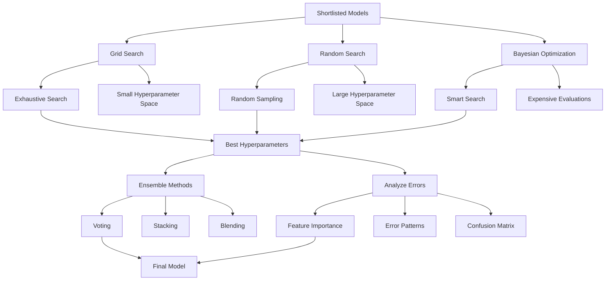

### Hyperparameter Tuning Methods

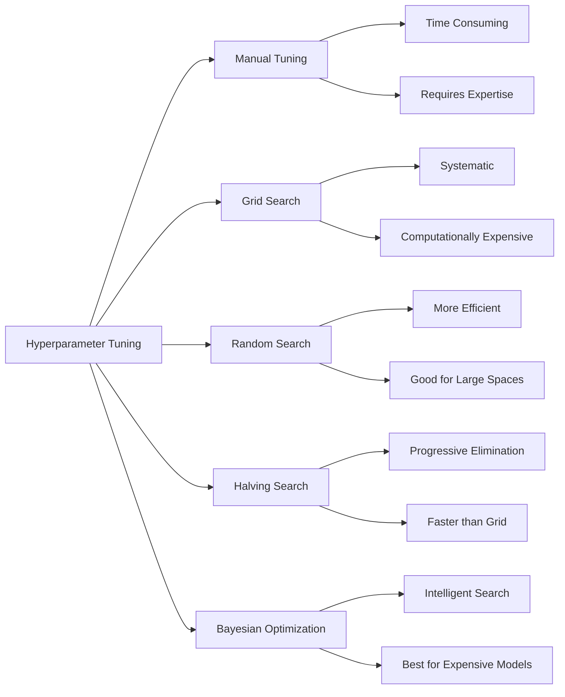

### Ensemble Methods

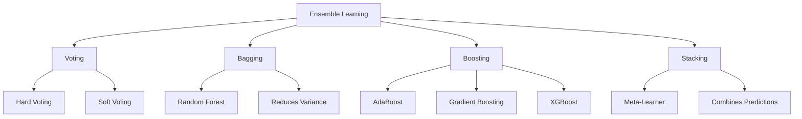

### Feature Importance Analysis

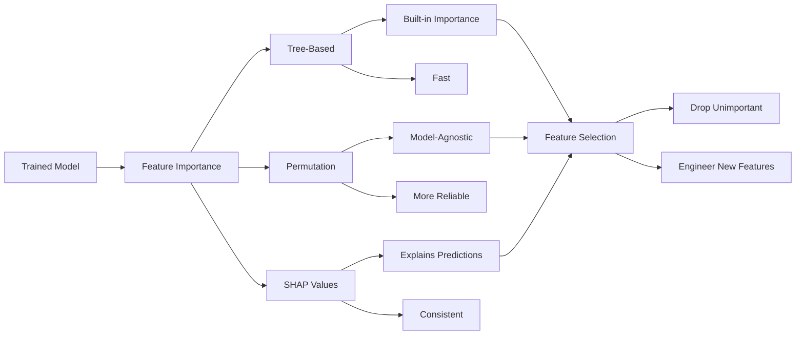

> [!TIP]
> **Fine-Tuning Strategies**
> - Start with random search for exploration
> - Use grid search for refinement
> - Consider ensemble methods
> - Analyze feature importance
> - Look for patterns in errors
> - Test on multiple validation sets
> - Balance performance vs complexity

---

## Step 7: Present Your Solution

### 🎯 Objective
Communicate findings and prepare for deployment approval.

### Presentation Structure

```mermaid
flowchart TB
    Start[Presentation]
    Problem[Problem Definition]
    Approach[Approach & Methodology]
    Results[Results & Performance]
    Insights[Key Insights]
    Limitations[Limitations & Assumptions]
    Next[Next Steps]
    P1[Business Context]
    P2[Success Metrics]
    A1[Data Pipeline]
    A2[Model Selection]
    A3[Evaluation Strategy]
    R1[Performance Metrics]
    R2[Comparison with Baseline]
    R3[Visualizations]
    I1[Feature Importance]
    I2[Error Analysis]
    I3[Business Impact]
    L1[Data Limitations]
    L2[Model Constraints]
    L3[Assumptions Made]
    N1[Deployment Plan]
    N2[Monitoring Strategy]
    N3[Future Improvements]
    
    Start --> Problem
    Problem --> Approach
    Approach --> Results
    Results --> Insights
    Insights --> Limitations
    Limitations --> Next
    Problem --> P1
    Problem --> P2
    Approach --> A1
    Approach --> A2
    Approach --> A3
    Results --> R1
    Results --> R2
    Results --> R3
    Insights --> I1
    Insights --> I2
    Insights --> I3
    Limitations --> L1
    Limitations --> L2
    Limitations --> L3
    Next --> N1
    Next --> N2
    Next --> N3
```

### Key Deliverables

```mermaid
mindmap
  root((Presentation Deliverables))
    Documentation
      Technical Report
      Model Card
      API Documentation
      User Guide
    Visualizations
      Performance Charts
      Feature Importance
      Error Analysis
      ROC and PR Curves
    Code and Models
      Trained Models
      Training Scripts
      Inference Code
      Unit Tests
    Deployment Plan
      Infrastructure Needs
      Monitoring Setup
      Rollback Strategy
      Maintenance Plan
```

### Stakeholder Communication

```mermaid
flowchart LR
    Stakeholders[Stakeholders]
    Technical[Technical Team]
    Business[Business Team]
    Executive[Executives]
    T1[Model Architecture]
    T2[Performance Metrics]
    T3[Technical Challenges]
    B1[Business Impact]
    B2[Use Cases]
    B3[ROI Estimation]
    E1[High-Level Summary]
    E2[Strategic Value]
    E3[Resource Requirements]
    
    Stakeholders --> Technical
    Stakeholders --> Business
    Stakeholders --> Executive
    Technical --> T1
    Technical --> T2
    Technical --> T3
    Business --> B1
    Business --> B2
    Business --> B3
    Executive --> E1
    Executive --> E2
    Executive --> E3
```

> [!IMPORTANT]
> **Presentation Checklist**
> - ✅ Clear problem statement
> - ✅ Data description and quality
> - ✅ Model performance metrics
> - ✅ Comparison with baseline
> - ✅ Feature importance insights
> - ✅ Error analysis
> - ✅ Limitations and assumptions
> - ✅ Deployment requirements
> - ✅ Monitoring plan
> - ✅ Next steps and improvements

---

## Step 8: Launch, Monitor, and Maintain

### 🎯 Objective
Deploy the model to production and ensure ongoing performance.

### Deployment Workflow

```mermaid
flowchart TB
    Model[Final Model]
    Package[Package Model]
    Deploy[Deploy to Production]
    Monitor[Monitor Performance]
    Maintain[Maintain & Update]
    P1[Save Model]
    P2[Create API]
    P3[Containerize]
    D1[Cloud Platform]
    D2[On-Premise]
    D3[Edge Devices]
    M1[Performance Metrics]
    M2[Data Quality]
    M3[System Health]
    MT1[Retrain Model]
    MT2[Update Features]
    MT3[Fix Issues]
    Alert{Alert?}
    Continue[Continue Monitoring]
    
    Model --> Package
    Package --> Deploy
    Deploy --> Monitor
    Monitor --> Maintain
    Package --> P1
    Package --> P2
    Package --> P3
    Deploy --> D1
    Deploy --> D2
    Deploy --> D3
    Monitor --> M1
    Monitor --> M2
    Monitor --> M3
    Maintain --> MT1
    Maintain --> MT2
    Maintain --> MT3
    M1 --> Alert
    Alert -->|Yes| MT1
    Alert -->|No| Continue
```

### Deployment Options

```mermaid
flowchart LR
    Deployment[Deployment Strategy]
    Batch[Batch Prediction]
    Online[Online Prediction]
    Realtime[Real-Time Streaming]
    B1[Scheduled Jobs]
    B2[Large Datasets]
    B3[Lower Latency Requirements]
    O1[REST API]
    O2[Web Service]
    O3[Moderate Latency]
    R1[Streaming Pipeline]
    R2[Low Latency]
    R3[Continuous Data]
    
    Deployment --> Batch
    Deployment --> Online
    Deployment --> Realtime
    Batch --> B1
    Batch --> B2
    Batch --> B3
    Online --> O1
    Online --> O2
    Online --> O3
    Realtime --> R1
    Realtime --> R2
    Realtime --> R3
```

### Monitoring Architecture

```mermaid
flowchart TB
    Production[Production System]
    Metrics[Collect Metrics]
    Dashboard[Monitoring Dashboard]
    Alerts[Alert System]
    M1[Model Performance]
    M2[Data Quality]
    M3[System Performance]
    M4[Business Metrics]
    MP1[Accuracy/RMSE]
    MP2[Prediction Distribution]
    MP3[Confidence Scores]
    DQ1[Missing Values]
    DQ2[Feature Drift]
    DQ3[Data Schema]
    SP1[Latency]
    SP2[Throughput]
    SP3[Error Rates]
    BM1[User Engagement]
    BM2[Revenue Impact]
    BM3[Customer Satisfaction]
    A1[Email Notifications]
    A2[Slack/Teams]
    A3[PagerDuty]
    
    Production --> Metrics
    Metrics --> Dashboard
    Dashboard --> Alerts
    Metrics --> M1
    Metrics --> M2
    Metrics --> M3
    Metrics --> M4
    M1 --> MP1
    M1 --> MP2
    M1 --> MP3
    M2 --> DQ1
    M2 --> DQ2
    M2 --> DQ3
    M3 --> SP1
    M3 --> SP2
    M3 --> SP3
    M4 --> BM1
    M4 --> BM2
    M4 --> BM3
    Alerts --> A1
    Alerts --> A2
    Alerts --> A3
```

### Model Degradation Detection

```mermaid
flowchart LR
    Monitor[Continuous Monitoring]
    Drift[Detect Drift]
    Data[Data Drift]
    Concept[Concept Drift]
    Performance[Performance Drift]
    D1[Feature Distribution Changes]
    D2[New Categories]
    D3[Missing Patterns]
    C1[Target Relationship Changes]
    C2[Seasonal Effects]
    P1[Accuracy Drop]
    P2[Increased Errors]
    Action[Trigger Retraining]
    
    Monitor --> Drift
    Drift --> Data
    Drift --> Concept
    Drift --> Performance
    Data --> D1
    Data --> D2
    Data --> D3
    Concept --> C1
    Concept --> C2
    Performance --> P1
    Performance --> P2
    D1 --> Action
    C1 --> Action
    P1 --> Action
```

### Maintenance Cycle

```mermaid
flowchart TB
    Start[Production Model]
    Monitor[Monitor Performance]
    Check{Performance OK?}
    Continue[Continue Monitoring]
    Investigate[Investigate Issues]
    Root[Root Cause Analysis]
    Fix[Implement Fix]
    DataIssue[Data Quality Issue]
    ModelIssue[Model Degradation]
    SystemIssue[System Issue]
    CleanData[Clean Data Pipeline]
    Retrain[Retrain Model]
    FixSystem[Fix Infrastructure]
    Test[Test Fix]
    Deploy[Deploy Update]
    Schedule{Scheduled Retrain?}
    
    Start --> Monitor
    Monitor --> Check
    Check -->|Yes| Continue
    Check -->|No| Investigate
    Investigate --> Root
    Root --> Fix
    Fix --> DataIssue
    Fix --> ModelIssue
    Fix --> SystemIssue
    DataIssue --> CleanData
    ModelIssue --> Retrain
    SystemIssue --> FixSystem
    CleanData --> Test
    Retrain --> Test
    FixSystem --> Test
    Test --> Deploy
    Deploy --> Monitor
    Continue --> Schedule
    Schedule -->|Yes| Retrain
    Schedule -->|No| Continue
```

### Retraining Strategy

```mermaid
mindmap
  root((Retraining Strategy))
    Triggers
      Performance Drop
      Data Drift
      Scheduled Time
      Business Changes
    Frequency
      Daily
      Weekly
      Monthly
      On-Demand
    Approach
      Full Retrain
      Incremental Learning
      Transfer Learning
      Online Learning
    Validation
      A/B Testing
      Shadow Mode
      Canary Deployment
      Blue-Green Deployment
```

> [!WARNING]
> **Production Challenges**
> - **Model Rot**: Performance degrades over time
> - **Data Drift**: Input distribution changes
> - **Concept Drift**: Relationship between features and target changes
> - **System Failures**: Infrastructure issues
> - **Scalability**: Handling increased load
> - **Latency**: Meeting response time requirements
> - **Cost**: Managing computational resources

### MLOps Best Practices

| **Practice** | **Description** | **Benefits** |
|--------------|-----------------|--------------|
| **Version Control** | Track models, data, and code | Reproducibility, rollback capability |
| **Automated Testing** | Unit tests, integration tests | Catch errors early, ensure quality |
| **CI/CD Pipeline** | Automated deployment | Faster iterations, reduced errors |
| **Monitoring** | Track performance and health | Early issue detection |
| **Logging** | Comprehensive logging | Debugging, audit trail |
| **Documentation** | Clear documentation | Knowledge sharing, onboarding |
| **A/B Testing** | Compare model versions | Data-driven decisions |
| **Feature Store** | Centralized feature management | Consistency, reusability |

---

## Key Takeaways

### Critical Success Factors

```mermaid
mindmap
  root((ML Project Success))
    Clear Objectives
      Business alignment
      Measurable goals
      Stakeholder buy-in
    Quality Data
      Sufficient quantity
      Representative samples
      Clean and labeled
    Right Model
      Appropriate complexity
      Well-tuned
      Validated properly
    Robust Pipeline
      Automated
      Reproducible
      Scalable
    Effective Monitoring
      Performance tracking
      Alert system
      Regular updates
    Team Collaboration
      Cross-functional
      Clear communication
      Knowledge sharing
```

### Common Pitfalls to Avoid

> [!CAUTION]
> **Top 10 ML Project Mistakes**
> 
> 1. **Not defining clear success metrics** - Start with measurable goals
> 2. **Data snooping bias** - Never look at test set during development
> 3. **Ignoring data quality** - Garbage in, garbage out
> 4. **Overfitting** - Model memorizes training data
> 5. **Not using cross-validation** - Unreliable performance estimates
> 6. **Forgetting feature scaling** - Most algorithms need it
> 7. **Data leakage** - Information from test set leaks into training
> 8. **Not monitoring in production** - Performance can degrade silently
> 9. **Ignoring business context** - Technical success ≠ business success
> 10. **Not planning for maintenance** - Models need ongoing care

### Project Timeline

```mermaid
gantt
    title Typical ML Project Timeline
    dateFormat YYYY-MM-DD
    section Planning
    Frame Problem           :2024-01-01, 3d
    Get Data               :2024-01-04, 2d
    section Development
    Explore Data           :2024-01-06, 5d
    Prepare Data           :2024-01-11, 7d
    Train Models           :2024-01-18, 10d
    Fine-Tune              :2024-01-28, 7d
    section Deployment
    Present Solution       :2024-02-04, 3d
    Deploy and Monitor     :2024-02-07, 5d
```

### Essential Tools & Libraries

| **Category** | **Tools** | **Purpose** |
|--------------|-----------|-------------|
| **Data Manipulation** | Pandas, NumPy | Data processing and analysis |
| **Visualization** | Matplotlib, Seaborn, Plotly | Data exploration and presentation |
| **ML Frameworks** | Scikit-Learn, XGBoost, LightGBM | Model training and evaluation |
| **Deep Learning** | TensorFlow, PyTorch, Keras | Neural networks |
| **Deployment** | Flask, FastAPI, Docker | Model serving |
| **Monitoring** | MLflow, Weights & Biases, TensorBoard | Experiment tracking |
| **Cloud Platforms** | AWS, GCP, Azure | Scalable infrastructure |
| **Version Control** | Git, DVC | Code and data versioning |

---

## Quick Reference Guide

### Performance Metrics Cheat Sheet

**Regression Metrics:**
- **RMSE**: √(Σ(ŷ - y)² / n) - Penalizes large errors
- **MAE**: Σ|ŷ - y| / n - Robust to outliers
- **R² Score**: 1 - (SS_res / SS_tot) - Proportion of variance explained
- **MAPE**: (Σ|y - ŷ| / |y|) / n × 100 - Percentage error

**Classification Metrics:**
- **Accuracy**: (TP + TN) / Total - Overall correctness
- **Precision**: TP / (TP + FP) - Positive prediction accuracy
- **Recall**: TP / (TP + FN) - True positive rate
- **F1 Score**: 2 × (Precision × Recall) / (Precision + Recall) - Harmonic mean

### Data Preprocessing Checklist

- [ ] Handle missing values
- [ ] Remove duplicates
- [ ] Fix data types
- [ ] Encode categorical variables
- [ ] Scale numerical features
- [ ] Handle outliers
- [ ] Create feature engineering
- [ ] Split train/validation/test sets
- [ ] Save preprocessing pipeline

### Model Selection Guide

```mermaid
flowchart TD
    Start{Problem Type?}
    Regression[Regression]
    Classification[Classification]
    Clustering[Clustering]
    R1{Data Size?}
    LinearReg[Linear/Ridge/Lasso]
    RF_Reg[Random Forest/XGBoost]
    C1{Data Size?}
    LogReg[Logistic Regression/SVM]
    RF_Class[Random Forest/XGBoost]
    CL1[K-Means/DBSCAN]
    
    Start --> Regression
    Start --> Classification
    Start --> Clustering
    Regression --> R1
    R1 -->|Small| LinearReg
    R1 -->|Large| RF_Reg
    Classification --> C1
    C1 -->|Small| LogReg
    C1 -->|Large| RF_Class
    Clustering --> CL1
```

---

## Summary

This cheat sheet provides a comprehensive overview of the **8-step end-to-end machine learning workflow**:

1. **Look at the Big Picture** - Define objectives and frame the problem
2. **Get the Data** - Acquire and split data properly
3. **Explore and Visualize** - Gain insights through analysis
4. **Prepare the Data** - Clean and transform for ML
5. **Select and Train Models** - Build and evaluate multiple models
6. **Fine-Tune Your Model** - Optimize hyperparameters
7. **Present Your Solution** - Communicate findings effectively
8. **Launch, Monitor, and Maintain** - Deploy and keep improving

> [!NOTE]
> **Remember**: Machine learning is an iterative process. You'll often need to go back to previous steps as you learn more about your data and problem. The key is to be systematic, document your work, and continuously improve based on feedback and monitoring.

---

**Created for**: Chapter 2 - End-to-End Machine Learning Project  
**Source**: Hands-On Machine Learning with Scikit-Learn, Keras, and TensorFlow  
**Last Updated**: 2025-11-30
